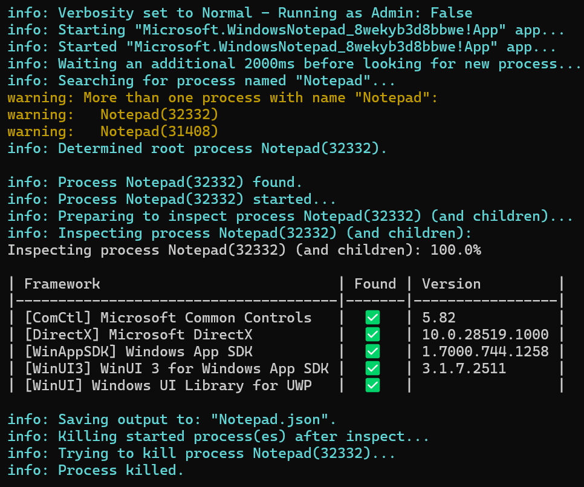

# Framework Detector

> [!IMPORTANT]
> :warning: **Status: Not Production** - Framework Detector is experimental and in active development. We'd love your feedback! Share your thoughts by creating an [issue](https://github.com/microsoft/FrameworkDetector/issues).

A library and set of tools for detecting the frameworks (UI frameworks, runtimes, components, libraries, etc.) used to build an application. e.g. Is this app a WPF app or a WinUI app? Does it use WebView2?

The Windows app eco-system is extraordinarily diverse with a long history, and developers often find very creative ways of using and combining the available app frameworks to meet their needs. As such, it can be a very challenging problem to programmatically detect what frameworks any particular app is using. Existing existing data sources are often plagued with inaccuracies, and lack detailed information as to how they made their determinations.

As such, the primary design goals of Framework Detector are to ensure the most specific, highest-quality, and openly auditable detections of frameworks or component used by applications. This includes:

1. Documenting the expected detection process for each supported framework (see the [docs](./docs) folder)
2. Implementing framework detector definitions which compose common checks using an easy-to-verify, fluent API (i.e. `ContainsLoadedModule("TargetFramework.dll")`)
3. Capturing all relevant metadata (input data and checks run) alongside results, to ensure a clear paper-trail

Framework Detector is meant to support collaborative, iterative development. There are simply too many frameworks and components for a small team to catch every framework, let alone edge-cases with how those frameworks appear in any given app. Hence the decision to make both the documentation and code open-source, and to elicit the expertise of framework experts toward increasing the number of frameworks detected and making existing detectors more robust.

## Getting Started

To get started building the library and tools yourself, see [Build and Test FrameworkDetector](./docs/BuildAndTest.md).

To get started using the FrameworkDetector.CLI tool, see [FrameworkDetector.CLI Usage](./docs/CliUsage.md).

For a high-level discussion of how the library works, see [Project Architecture](./docs/ProjectArchitecture.md).

For information on how the library detects specific frameworks, see the [Framework Docs](./docs/Frameworks/).

To read about the output JSON that the FrameworkDetector.CLI tool can create, see [Output JSON Schema](./docs/OutputJsonSchema.md).

To read how to extend FrameworkDetector with plugins, see [Plugin Support](./docs/PluginSupport.md).

## License

MIT
